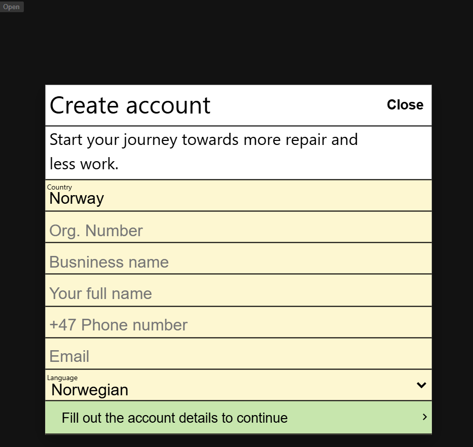
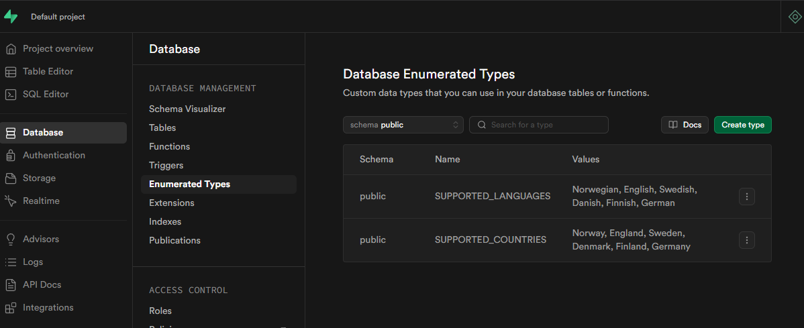
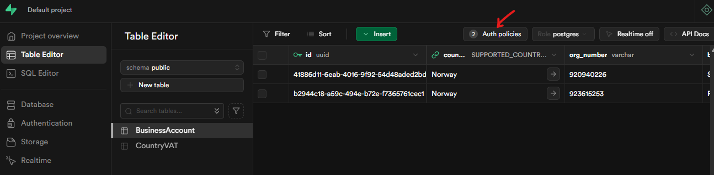
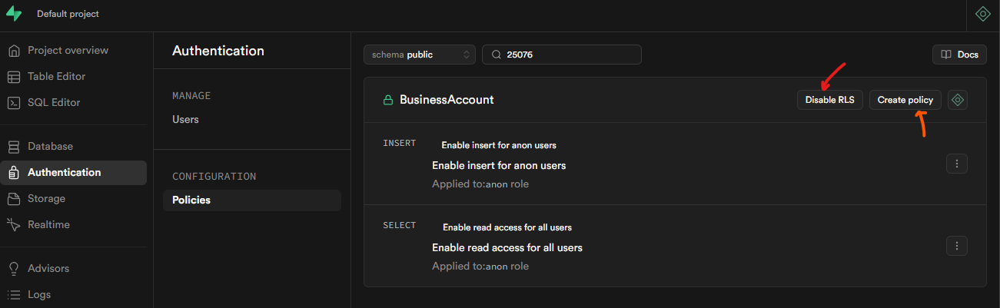
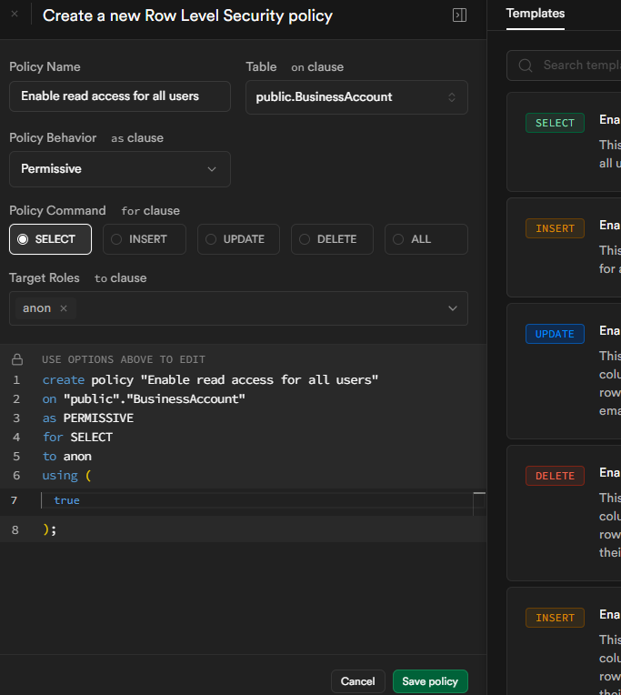
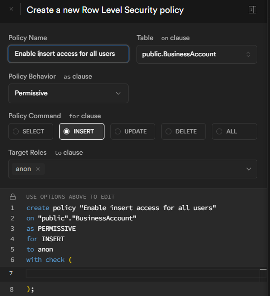
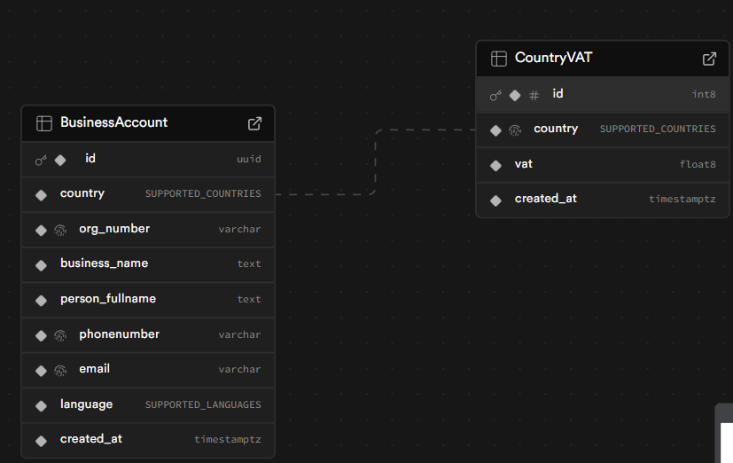

# Fikse

>Med utgangspunkt i vedlagt Figma-skisse skal det lage et konkret mobiltilpasset forslag til implementasjon både i frontend og backend.

For detailed descriptions of the decitions made realated to the frontend tech and backend tech see [Decide on frontend tech #2](https://github.com/Snorre98/Fikse/issues/2) and [make backend decisions and setup backend #12
](https://github.com/Snorre98/Fikse/issues/12).



## How to run the dev environment

First you have to clone the repo to your computer. The projects root is `📁Fikse`, with two main directories `📁fikse-frontend` and `📁fikse-backend`.

In the root of `📁fikse-frontend` there is a `.env.example` file. Rename this to `.env` or create a new `.env` and copy the content of `.env.example` into it.

To run the project you have to have Node (it works for me with Node.js v22.14.0) and npm (11.2.0) installed, as well as Docker for the backend. I have been running the project in [WSL](https://learn.microsoft.com/en-us/windows/wsl/install).

### Frontend

1) Navigate to `📁fikse-frontend`
2) Run `npm install`

Now to start the development server run `npm run dev`

### Backend

> As mentioned the backend requires Docker. I have been using [Docker Desktop integrated with WSL](https://docs.docker.com/desktop/features/wsl/).

1) Navigate to `📁fikse-backend`
2) Run `npm install`

Now to start a local Supabase development instance run `npx supabase start`. To stop the service run `npx supabase stop`.

#### Important ‼️

You need to create a couple of tables in the database. This can be done in the supabase dashboard, accessable here http://127.0.0.1:54323/project/default when supabase is running localy.


First you need to create some Enum types, as shown in the image bellow:



Go to the SQL editor and run this SQL statement:


```sql
create table public."CountryVAT" (
  id bigint generated by default as identity not null,
  country public.SUPPORTED_COUNTRIES not null,
  vat double precision not null,
  created_at timestamp with time zone not null default now(),
  constraint CountryVAT_pkey primary key (id),
  constraint CountryVAT_country_key unique (country)
) TABLESPACE pg_default;

```

Then this:

``` sql
create table public."BusinessAccount" (
  id uuid not null default gen_random_uuid (),
  country public.SUPPORTED_COUNTRIES not null,
  org_number character varying not null,
  business_name text not null,
  person_fullname text not null,
  phonenumber character varying not null,
  email character varying not null,
  language public.SUPPORTED_LANGUAGES not null,
  created_at timestamp with time zone not null default now(),
  constraint BusinessAccount_pkey primary key (id),
  constraint BusinessAccount_org_number_key unique (org_number),
  constraint BusinessAccount_phonenumber_key unique (phonenumber),
  constraint BusinessAccount_email_key unique (email),
  constraint BusinessAccount_country_fkey foreign KEY (country) references "CountryVAT" (country) on update RESTRICT on delete RESTRICT
) TABLESPACE pg_default;
```

Here is an example of the SQL editor:


In addition you will have to either disable row level security on both the BusinessAccount and the CountryVAT table, or add these Row Level Security policies on the tables. 💡 I advice that you disable RLS for testing purposes.


Here is where you will find the editor for Row Level Security. I would advice that you disable it for testing purposes, but RLS is generally good practice and should be considered throughout development.

The menue for RLS is found by either going through the Table Editor to the Auth policies, or going to the Authentication tab and then policies. The former will show all policies in `public`.




The arrows show where you can either disable RLS or create policies. Again, for testing it might be best to diable RLS.



#### Add these policies to both BusinessAccount and CountryVAT tables


------------------




# Database definition diagram



